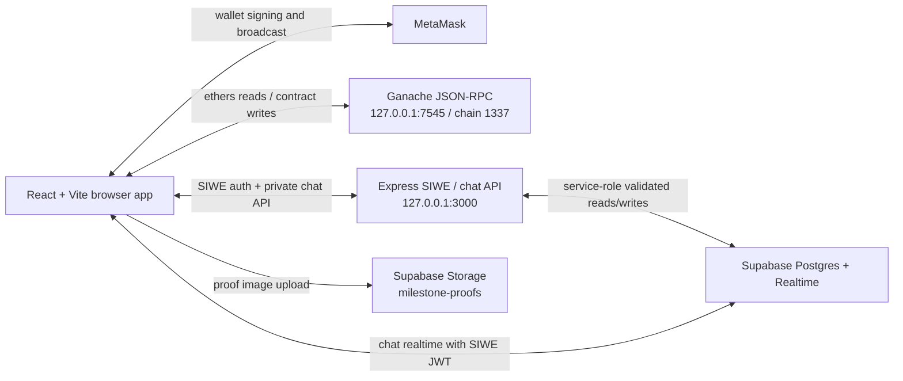
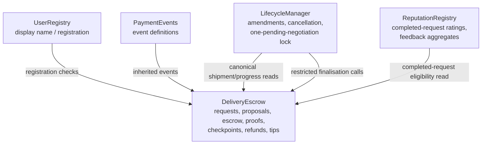
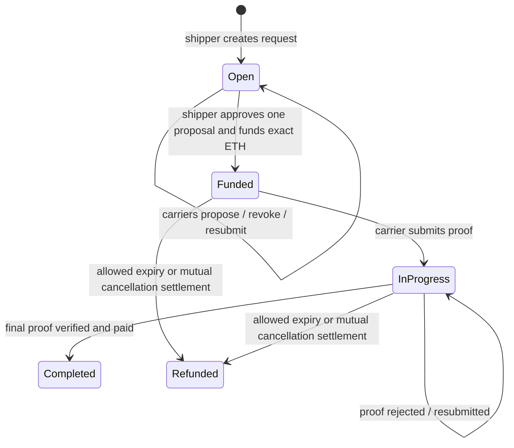
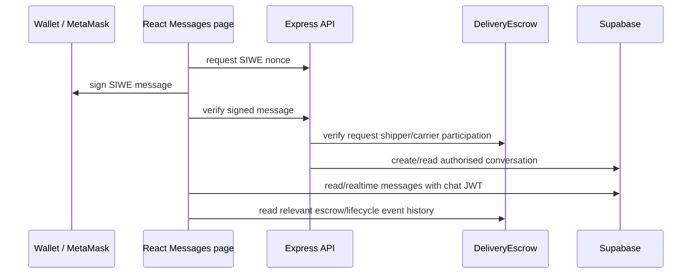

# CargoChain — Architecture Overview

> Current v1 architecture. This project is designed for a local Ganache demonstration, not a public production deployment.

## 1. System overview



The browser is the DApp. Ganache holds all delivery state and ETH accounting. Express is not a delivery authority: it only authenticates chat users and verifies that they are shipment participants before it accesses Supabase.

## 2. Contract relationships



`DeliveryEscrow` is the canonical shipment state. `LifecycleManager` deliberately does not copy request/cargo/milestone state; it reads the lifecycle snapshot and can only apply a previously validated amendment or accepted cancellation through escrow-only hooks.

Deployment order is:

```text
UserRegistry
LifecycleManager
DeliveryEscrow(registryAddress, lifecycleManagerAddress)
LifecycleManager.initializeDeliveryEscrow(escrowAddress)
ReputationRegistry(escrowAddress)
```

The frontend creates read-only ethers contract instances from Truffle artifacts and validates that the manager and reputation registry escrow links match the artifact address. This catches a common local Ganache failure where MetaMask/RPC points to a stale deployment.

## 3. On-chain delivery flow



### Stable checkpoint identity

Every checkpoint receives an immutable `milestoneId`. The contract keeps a separate execution-order list. An accepted amendment that inserts a new checkpoint gives it a new ID and adjusts the execution order, so old proof URLs, payouts, event IDs, and historical UI references retain their meaning.

## 4. Proof and payment data path

```text
Carrier selects JPEG / PNG / WebP file
  → browser computes SHA-256
  → browser uploads file to Supabase Storage
  → browser submits proof URL + remark to DeliveryEscrow
  → shipper verifies/rejects proof
  → verification transfers that checkpoint's payment to carrier
```

The image is not written to the blockchain. The browser uses a SHA-256-derived object path, then the URL and proof metadata are recorded in the contract. The contract does not independently verify the file content, and Storage URLs are public in this assignment build.

## 5. Negotiation architecture

An accepted request has one shared lifecycle negotiation slot:

```text
None ↔ Pending amendment
None ↔ Pending cancellation
```

Only one can be pending at a time. Amendment acceptance verifies that milestone progress has not changed since proposal. Cancellation settlement verifies that no proof is currently awaiting the shipper's decision. These checks prevent stale or exploitative post-acceptance changes.

## 6. Chat architecture



Conversation identity includes chain ID, deployed contract address, request ID, and carrier wallet. This prevents request-number collisions after contract redeployment. Chat text is private off-chain data; the delivery timeline is on-chain event-derived and filtered to the relevant shipper/carrier pair.

## 7. Local deployment topology

| Service | Address | Notes |
|---|---|---|
| Ganache | `http://127.0.0.1:7545` | Chain/network ID `1337`; deterministic accounts in launcher mode. |
| Vite | `http://127.0.0.1:5174` | Browser frontend. |
| Express | `http://127.0.0.1:3000` | SIWE and chat API; needs Supabase env values. |
| Vite preview | `http://127.0.0.1:8080` | Production-bundle inspection. |

`npm run dev:all` starts Ganache, compiles, reset-migrates, then launches Express and Vite. A reset migration redeploys contracts and refreshes artifact addresses; it does not erase historical contracts from the local Ganache database.

## 8. Security and scope boundaries

- Private keys and service-role keys are only in `.env`; `VITE_*` variables are public browser values.
- State-changing escrow actions require a registered wallet and request-participant ownership checks.
- Chat access is checked by the API and constrained by Supabase RLS.
- Contract state is not updated by the chat server or Supabase.
- Carrier ratings are immutable and structured; objective performance is derived from contract state/events instead of user-entered claims.
- v1 excludes Sepolia, QR verification, public general chat, staking, automatic dispute-window release, and recovery/republish.

See [`README.md`](../README.md) for setup, [`BusinessFlow.md`](BusinessFlow.md) for user flow, and [`API_v1.md`](../API_v1.md) for the full contract surface.
