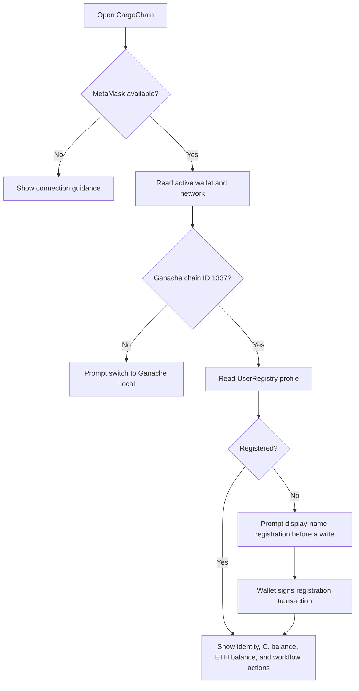
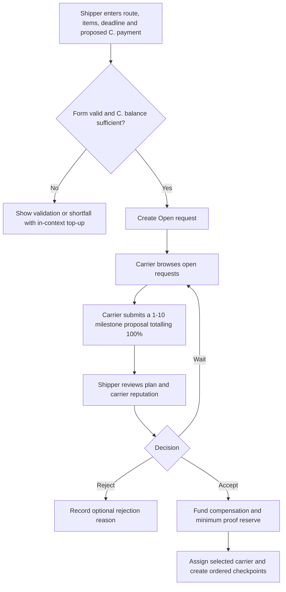
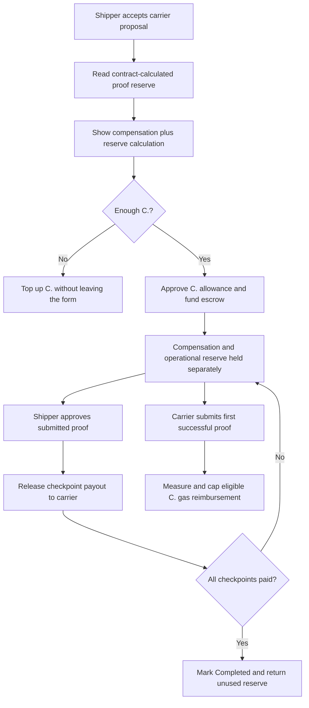
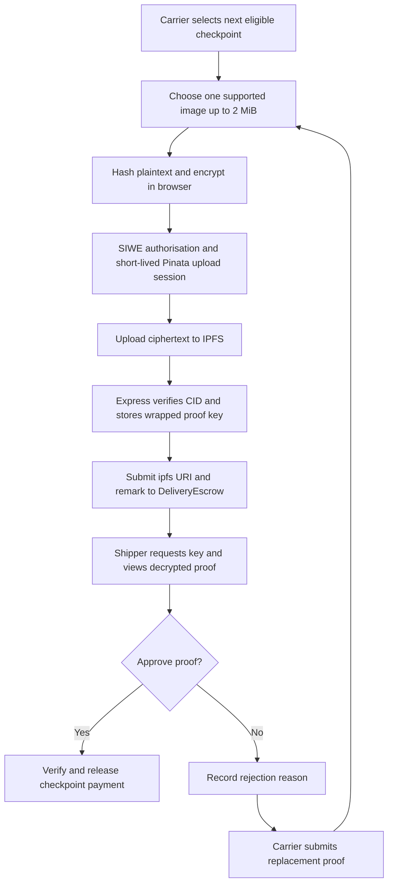
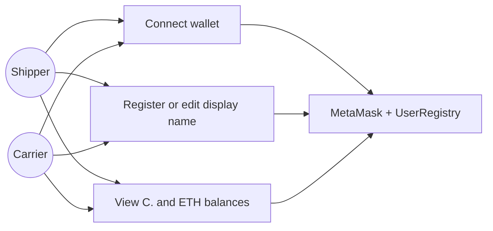
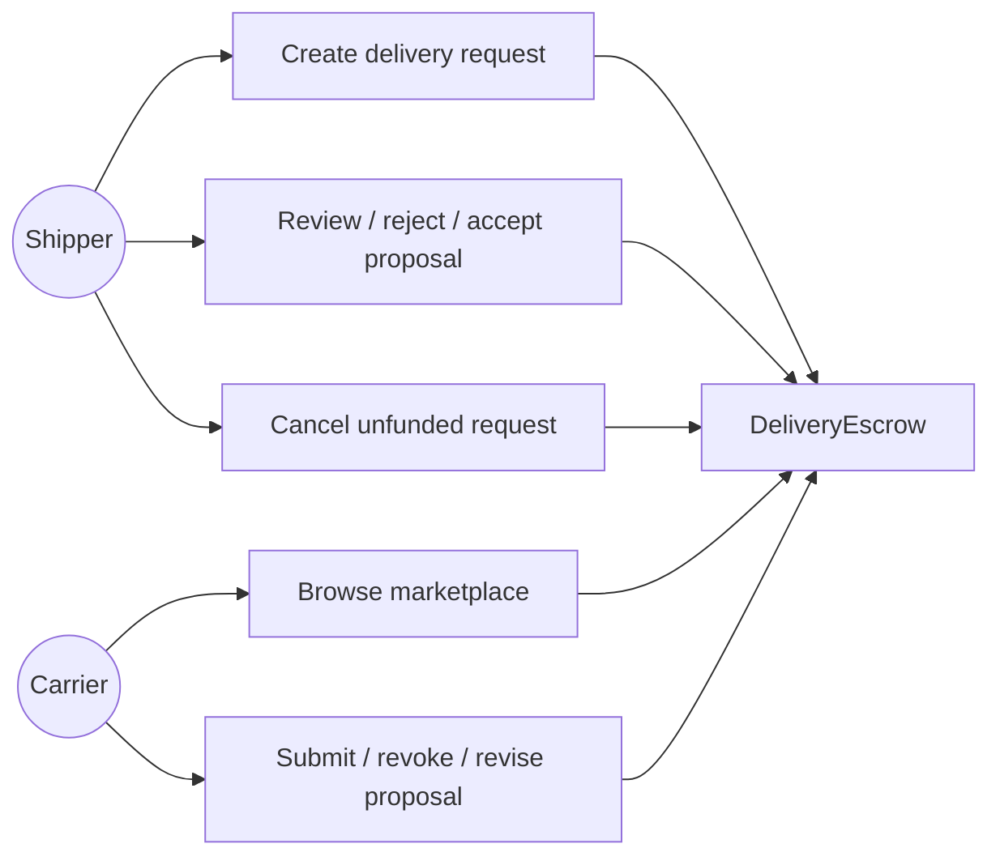
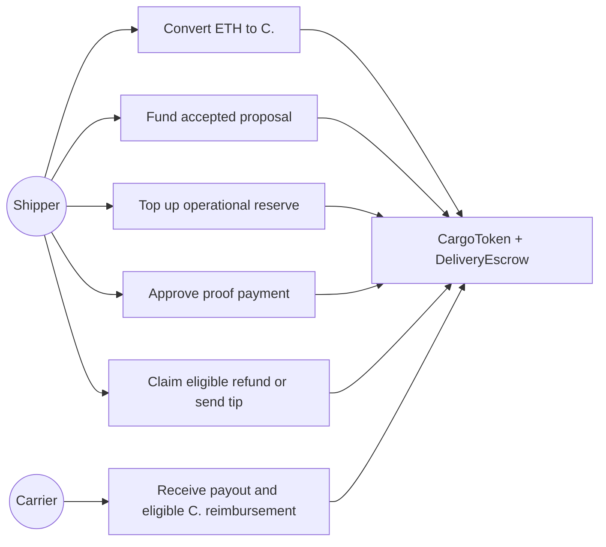
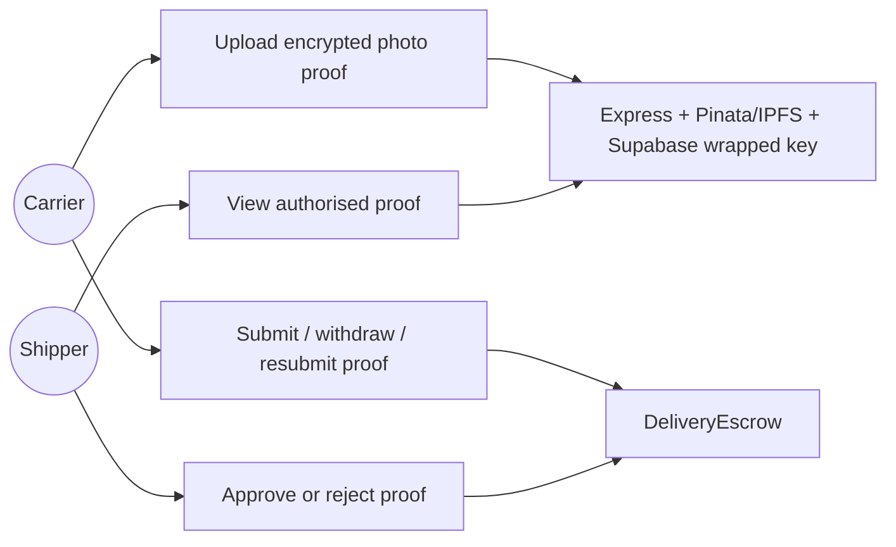

# CargoChain — Business Flow

> Current user-facing workflow. For technical signatures and validation messages, see [`API_v1.md`](../API_v1.md).

## 1. Core rule

> A shipper creates a delivery request. Carriers submit milestone proposals. The shipper chooses and funds one proposal. The carrier submits proof for each checkpoint. The shipper verifies proof, releasing checkpoint payment. Only unpaid escrow can ever return to the shipper.

## 2. Actors

| Actor | Capabilities |
|---|---|
| Shipper | Create requests, review/reject/accept proposals, fund escrow, verify proof, request/answer agreements, claim allowed refunds, tip after completion. |
| Carrier | Browse requests, propose/revoke/resubmit a plan, submit proof, request/answer agreements, receive released payment and tip. |
| DeliveryEscrow | Holds accepted-plan escrow, records proof/checkpoint state, releases payment, refunds remaining escrow, and records tip. |
| LifecycleManager | Records amendments/cancellations, enforces one pending negotiation, and finalises restricted escrow actions. |
| Pinata/IPFS | Stores encrypted proof ciphertext and serves it through a public gateway; it does not decide delivery state or payments. |
| Supabase | Stores private chat text and server-only wrapped proof-key records. It does not decide delivery state or payments. |

Every state-changing shipment action requires a registered wallet. One wallet may participate as a shipper in one request and carrier in another.

## 3. Request and proposal flow

```text
Shipper creates Open request
        ↓
Carriers submit, revoke, or resubmit proposals
        ↓
Shipper reviews active plans and history
        ↓
Shipper approves exactly one plan and funds CARGO compensation plus the proof reserve
        ↓
Accepted carrier starts delivery; other active plans are rejected
```

- A request remains `Open` while proposals are being collected.
- Each carrier can retain at most one active proposal for that request.
- The shipper may manually reject a plan with an optional note.
- Selecting one proposal automatically rejects all competing active plans with an explicit recorded reason.
- The accepted plan produces the initial checkpoint records and locks the advertised CARGO plus its refundable operational reserve.

## 4. Proof and payment flow

```text
Carrier chooses next checkpoint
        ↓
Browser SHA-256 hashes photo → AES-256-GCM encrypts in memory
        ↓
Express authorizes → Pinata signed URL → public ciphertext upload
        ↓
Carrier submits canonical `ipfs://` proof URI + remark on-chain
        ↓
Shipper verifies or rejects
        ├─ verify → checkpoint paid → CARGO to carrier
        └─ reject → carrier may resubmit proof
```

- Proof images must be JPEG, PNG, WebP, GIF, AVIF, or BMP and at most **2 MiB** before encryption. SVG is intentionally excluded because it can contain active or externally loaded content.
- New proof plaintext is encrypted in the browser; public IPFS exposes only ciphertext. Express verifies the ciphertext hash and stores a wrapped key for authorized viewing.
- The carrier pays native ETH gas to submit proof. The first successful submission for each checkpoint may receive measured and capped CARGO reimbursement from the request's operational reserve. Withdrawals, corrected submissions, reverted transactions, and repeated submissions are not reimbursed.
- The contract protects the reserve required for later checkpoints before paying an earlier reimbursement. Extra funded reserve may increase saved gas-price coverage, and unused reserve returns to the shipper when the request settles.
- Checkpoints must complete in the request's current execution order.
- A paid checkpoint cannot be paid again; paid funds are never clawed back.
- Once all checkpoints are paid, the request becomes `Completed`.

## 5. Refund and cancellation flow

### Deadline-based refund

When the delivery deadline passes, the shipper can claim the unpaid balance. If no checkpoint was paid, that is the full original escrow; if some were paid, it is only the remainder. A refunded request cannot accept later proof.

### Mutual cancellation

For a funded/in-progress request before deadline:

1. Shipper or carrier opens a cancellation request with a required explanation and response deadline.
2. Work continues under the existing agreement while it is pending.
3. The other party accepts or rejects; requester may withdraw; anyone may expire it after its response deadline.
4. Acceptance is blocked while a checkpoint proof awaits shipper verification.
5. On acceptance, released checkpoint payments stay with the carrier and remaining escrow returns to the shipper.

The request-level negotiation lock means an amendment cannot be opened while cancellation is pending, and vice versa.

## 6. Amendment flow

```text
Current funded agreement
        ↓
Participant proposes a changed deadline and/or new funding plan
        ↓
Counterparty reviews before/after agreement
        ├─ accept → escrow applies change
        ├─ reject → original agreement continues
        ├─ requester withdraws → original agreement continues
        └─ response expires → original agreement continues
```

Supported changes:

- Direct shipper deadline extension when no negotiation is pending.
- Mutually approved deadline changes. Carrier cannot shorten; shipper shortening requires new funding and carrier approval.
- Additional CARGO to unpaid existing checkpoints only.
- Newly funded checkpoints inserted before an eligible unpaid checkpoint or appended as final.
- A new checkpoint must include its contract-calculated proof-operation reserve.
- `EachPaysOwn` leaves response gas with the acting party. `RequesterCoversResponse` stages a separate CARGO allowance that reimburses one successful acceptance or rejection and returns any unused amount to its funder.

Invariant: original payouts, paid work, proof references, and checkpoint IDs are not rewritten. New checkpoints receive new immutable IDs, while a separate execution-order list controls their sequence.

If the shipper stages CARGO with an amendment, rejection, withdrawal, or expiry refunds the staged compensation, operational reserve, and unused response allowance to their respective funders. Carrier-requested funding is supplied by the shipper only when accepting.

## 7. Completion and tip

After the final checkpoint is paid, the shipper may make one optional tip payment directly to the carrier. It is separate from escrow and does not change the request's original payment, released total, or refund calculation.

## 8. Private chat and activity

- A shipper and proposing carrier can open a private request-scoped conversation after SIWE authentication. While the request remains open and no carrier is assigned, conversations for carriers with proposal history remain writable. After acceptance, only the selected carrier's conversation remains writable; other carrier conversations become read-only.
- Supabase stores message text; the Express API checks current on-chain participation before granting access.
- The conversation also shows verified activity derived from escrow/lifecycle events, filtered to the exact carrier. Another carrier's proposal activity is not shown in this conversation.
- Pending amendment/cancellation activity provides a review action that navigates to the correct Track section.

## 9. Carrier reputation

After a request reaches `Completed`, its shipper can submit one permanent 1-5 rating and up to three predefined feedback tags for the accepted carrier. The available tags are good communication, clear milestone updates, careful cargo handling, responsive, professional service, communication could improve, milestone updates could improve, and cargo handling concern. Free-text reviews are not collected.

Proposal cards show the verified rating average and count. A read-only reputation modal adds completed-delivery, on-time, expiry, accepted-cancellation, and common-tag information during proposal review, while `/account` shows the connected wallet's own rating and delivery aggregates. Reputation views do not reveal route, cargo, proof, escrow, request ID, or chat details.

## 10. Out of scope

- Carrier republishing/recovery and custody transfer.
- QR recipient verification.
- Automatic dispute-window payment release.
- General marketplace messages and staking.

## 11. Activity diagrams

The following diagrams reflect the implemented v1 workflow.

### 11.1 User profile and wallet



### 11.2 Goods request management



### 11.3 Payment and escrow



### 11.4 Milestone tracking and proof



## 12. Use case diagrams

### 12.1 User profile and wallet



### 12.2 Goods request management



### 12.3 Payment and escrow



### 12.4 Milestone tracking and proof


