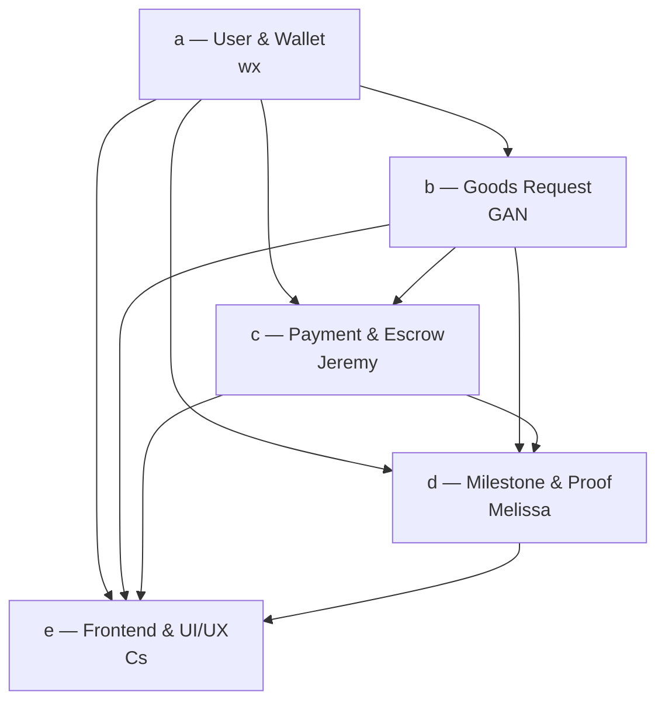

# CargoChain — Module Split (detailed responsibilities)

> Locked 2026-07-05. Each module has one named owner. This file is the contract between modules — if you need to change a public function, ping the owner first.

---

## a. User Profile & Wallet — wx

### Files owned
- `contracts/UserRegistry.sol` (~80 LOC)
- `test/userRegistry.test.js` (~6 test cases)
- Frontend files in `src/js/` related to wallet connect (coordinate with e)

### Public surface (UserRegistry.sol)

```solidity
function register(string calldata displayName, Role role) external;
function setRole(Role role) external;
function isRegistered(address user) external view returns (bool);
function getProfile(address user) external view returns (UserProfile memory);
function getRole(address user) external view returns (Role);

enum Role { None, Shipper, Carrier, Both }

struct UserProfile {
    string displayName;
    Role role;
    uint256 registeredAt;
}
```

### Events
- `UserRegistered(address user, Role role, uint256 timestamp)`
- `RoleChanged(address user, Role oldRole, Role newRole)`

### Responsibilities
- Wallet connection (MetaMask or Ganache via `window.ethereum`)
- Network validation (warn if not on expected chain)
- One-time registration with display name + role selection
- Role switching (a user can be Both shipper and carrier)

### Hand-offs
- Other contracts query `getRole(msg.sender)` to enforce permissions
- The frontend reads `getProfile()` to display user info

### NOT responsible for
- Request / milestone logic (b, c, d)
- Any payment logic (c)

---

## b. Goods Request Management — GAN

### Files owned
- `contracts/DeliveryEscrow.sol` (the request-lifecycle portion — coordinate with c for payment functions)
- `contracts/LifecycleManager.sol` (full ownership)
- `test/deliveryEscrow.test.js` (request-related cases)
- `test/lifecycleManager.test.js` (full file)
- Frontend `src/index.html`, `src/shipper.html` (create/cancel parts)

### Public surface (DeliveryEscrow.sol — request functions)

```solidity
function createRequest(
    string calldata goodsInfo,
    Milestone[] calldata milestones,
    uint256 acceptDeadline
) external payable returns (uint256 requestId);

function acceptRequest(uint256 requestId) external;        // FCFS
function cancelRequest(uint256 requestId) external;       // shipper-only, pre-accept
function getOpenRequests(uint256 offset, uint256 limit) external view returns (uint256[] memory);
function getRequest(uint256 requestId) external view returns (Request memory);
function resetCarrier(uint256 requestId) external;         // internal helper called by LifecycleManager
```

### Public surface (LifecycleManager.sol)

```solidity
function republishIfStuck(uint256 requestId) external;     // anyone after deadline
function getRequestTimeline(uint256 requestId) external view returns (TimelineEvent[] memory);
function isStuck(uint256 requestId) external view returns (bool);
```

### Events (from DeliveryEscrow.sol)
- `RequestCreated(uint256 requestId, address shipper, uint256 reward)`
- `RequestAccepted(uint256 requestId, address carrier)`
- `RequestCancelled(uint256 requestId, address by)`
- `RequestRepublished(uint256 requestId, address previousCarrier)`

### Hand-offs
- On `createRequest`, the `msg.value` is held by the contract → hands off to c for management
- On `cancelRequest` (if escrowed), internally calls c's `refundToShipper()`
- On `republishIfStuck`, calls c's `releaseStage()` for partial payment to abandoned carrier

### NOT responsible for
- The exact refund math (coordinate with c)
- Photo-proof verification (d)

---

## c. Payment & Escrow — Jeremy

### Files owned
- Payment-related functions in `contracts/DeliveryEscrow.sol` (coordinate with b for the file)
- `contracts/PaymentEvents.sol` (~30 LOC, events only)
- Frontend `src/shipper.html` (escrow balance display, transaction history)
- Frontend `src/js/contracts.js` — escrow contract instance wiring

### Public surface (DeliveryEscrow.sol — payment functions)

```solidity
function releaseStage(uint256 requestId, uint256 milestoneId) external;  // only callable by MilestoneVerifier
function refundToShipper(uint256 requestId) external;                     // shipper-only or via cancel
function escrowBalance(uint256 requestId) external view returns (uint256);
function getTransactionHistory(uint256 requestId) external view returns (PaymentRecord[] memory);
function confirmByTimeout(uint256 requestId, uint256 milestoneId) external; // dispute-window auto-release
```

### Payment events (PaymentEvents.sol)

```solidity
event PaymentReleased(uint256 indexed requestId, uint256 indexed milestoneId, uint256 amount, address indexed recipient);
event RefundIssued(uint256 indexed requestId, address indexed to, uint256 amount);
event EscrowLocked(uint256 indexed requestId, uint256 amount);
event PartialPayOnRepublish(uint256 indexed requestId, address indexed abandonedCarrier, uint256 amount);
```

### Responsibilities
- ETH escrow accounting (per-request balance)
- Milestone-based payout: `amount = reward / milestoneCount`
- Refund on cancel
- Partial payment to abandoned carrier on republish
- Transaction history view (for shipper dashboard)

### Hand-offs
- `releaseStage` is called by `MilestoneVerifier.verifyMilestone(true)` (d)
- `refundToShipper` is called internally by `cancelRequest` (b)
- `confirmByTimeout` is callable by anyone after 72h dispute window

### NOT responsible for
- Request creation / acceptance (b)
- Proof hash storage (d)

---

## d. Milestone Tracking & Proof — Melissa

### Files owned
- `contracts/MilestoneVerifier.sol` (~150 LOC)
- `test/milestoneVerifier.test.js` (≥6 test cases)
- Frontend `src/carrier.html` (proof submission UI)

### Public surface (MilestoneVerifier.sol)

```solidity
enum MilestoneStatus { Pending, AwaitingProof, AwaitingVerification, Verified, Paid, Rejected }

function submitProof(uint256 requestId, uint256 milestoneId, bytes32 proofHash) external;
function verifyMilestone(uint256 requestId, uint256 milestoneId, bool approve) external;  // shipper-only
function markMilestoneComplete(uint256 requestId, uint256 milestoneId) external;         // for non-photo milestones
function getProofHash(uint256 requestId, uint256 milestoneId) external view returns (bytes32);
function getMilestoneStatus(uint256 requestId, uint256 milestoneId) external view returns (MilestoneStatus);
```

### Events (MilestoneVerifier.sol)

```solidity
event MilestoneSubmitted(uint256 indexed requestId, uint256 indexed milestoneId, bytes32 proofHash, address indexed carrier);
event MilestoneVerified(uint256 indexed requestId, uint256 indexed milestoneId, bool approved, address indexed verifier);
```

### Responsibilities
- Store `bytes32` proof hashes per (requestId, milestoneId)
- State machine: Pending → AwaitingProof → AwaitingVerification → Verified → Paid
- Enforce `verifyMilestone` only callable by `request.shipper`
- After successful verify, call `DeliveryEscrow.releaseStage(...)` (cross-contract call into c)

### Hand-offs
- Triggers c's `releaseStage()` on `verifyMilestone(true)` → ETH flows to carrier
- Reject path (`verifyMilestone(false)`) resets state but does NOT pay

### NOT responsible for
- ETH handling directly (c owns all `payable` logic)
- Photo storage (frontend + Express server)

---

## e. Frontend & UI/UX — Cstan (Cs)

### Files owned
- `src/index.html`, `src/shipper.html`, `src/carrier.html`, `src/track.html`
- `src/css/style.css`
- `src/js/web3-init.js`, `src/js/app.js`, `src/js/contracts.js`, `src/js/upload.js`
- `server/upload-server.js` (Express)

### Responsibilities
- Wallet detection, MetaMask prompt, account-switch handling
- ABIs loaded as static JSON (course-style, copied from `build/contracts/` after migrate)
- Form rendering for create request, browse marketplace, accept, upload photo, verify
- Photo upload flow: `FileReader` → `crypto.subtle.digest('SHA-256', ...)` → POST to Express → call `submitProof`
- Event listening (`RequestCreated`, `MilestoneVerified`, `PaymentReleased`, etc.) → UI refresh
- Public tracker page reads `getRequestTimeline()` without a wallet

### Hand-offs
- Reads from a (`getProfile`), b (`getOpenRequests`), c (`escrowBalance`), d (`getMilestoneStatus`)
- Writes to b (`createRequest`, `acceptRequest`, `cancelRequest`), c (`confirmByTimeout`), d (`submitProof`, `verifyMilestone`, `markMilestoneComplete`)

### NOT responsible for
- Any Solidity code
- Truffle config

---

## Cross-module contracts (all modules must agree)

```
DeliveryEscrow.sol  — co-owned by GAN (request) + Jeremy (payment)
                      File lives in /contracts/, both edit.
                      Coordinate before pushing changes.

LifecycleManager.sol — owned by GAN, but reads milestone state from d.
                      Coordinate with Melissa on cross-contract calls.
```

---

## Module dependency graph (mermaid-friendly)



---

## Start order

1. **wx** first — `UserRegistry.sol` defines `Role` enum and registration flow; everyone else references it.
2. **GAN** next — `DeliveryEscrow.sol` defines the `Request` and `Milestone` structs; c and d reuse these types.
3. **Jeremy** (c) + **Melissa** (d) **in parallel** — both consume the types from b, both work on `DeliveryEscrow.sol`'s payment side (coordinate).
4. **Cstan (e)** runs throughout — starts with web3-init + a basic login screen after (1), then layers screens as each BE module lands.

---

## When you change something in another module's file

**Always coordinate first.** Examples:

- Jeremy needs to add a new field to `Request` struct → ping GAN.
- Melissa needs a new event parameter → update `PaymentEvents.sol` (Jeremy's file) AND `API_v1.md` AND `docs/Architecture.md`.
- Cstan needs a new function from a BE module → request the function via GitHub issue, don't PR into the BE module's file.

---

## Conflict resolution

If two members need to edit the same file at the same time:

1. Coordinate in the group chat first.
2. Use feature branches (`feat/<owner>-<module>`), never commit directly to `main`.
3. PR review by the OTHER member of the shared file.
4. After merge, both update `API_v1.md`.